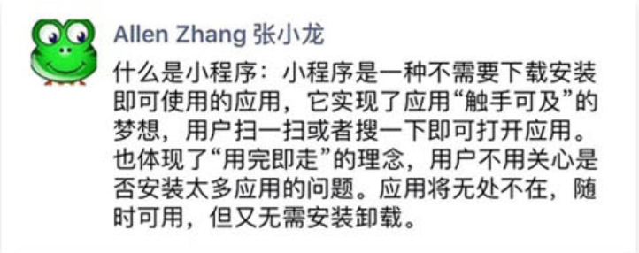
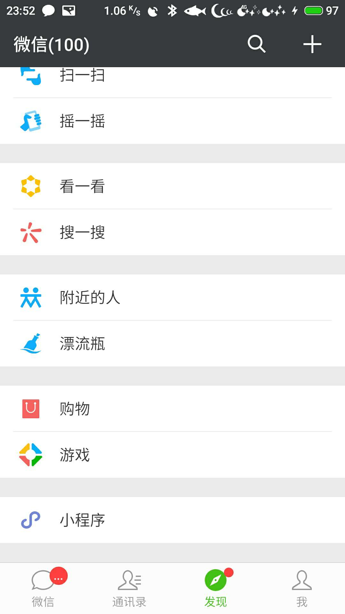
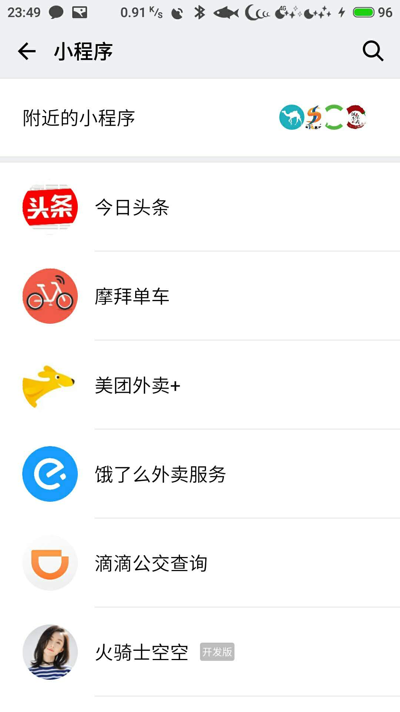
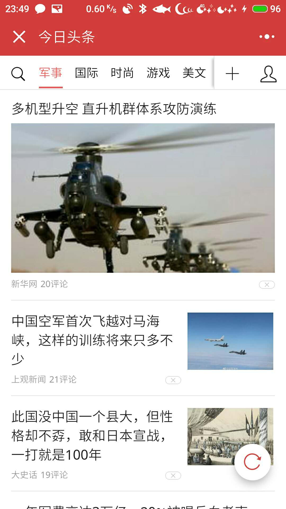

## 小程序是什么？ 

## 体验小程序

可以在微信中体验下一些已有的小程序!

|                            |      |      |
| -------------------------- | ---- | ---- |
|  |       |      |
|                            |      |      |
|                            |      |      |

体验官方小程序demo

## 小程序的优势?

| 应用类型 | 性能 | 所需的运行环境 | 推广成本 |
| -------- | ---- | -------------- | -------- |
| 小程序   | 高   | 微信           | 低       |
| 网页     | 低   | 浏览器         | 低       |
| 手机软件 | 高   | 手机           | 高       |

## 学习小程序前需要会什么?

HTML

CSS

JavaScript

## 相关资料及链接

[官方文档](https://mp.weixin.qq.com/debug/wxadoc/dev/)

[当前文档在线版本](http://mini-programs.huoqishi.net)

[小程序百科](https://baike.baidu.com/item/%E5%BE%AE%E4%BF%A1%E5%B0%8F%E7%A8%8B%E5%BA%8F/20171697?fr=aladdin)

> 各平台开发者工具下载地址
>
> [windows 64 位](https://servicewechat.com/wxa-dev-logic/download_redirect?type=x64&from=mpwiki)
>
> [windows 32 位](https://servicewechat.com/wxa-dev-logic/download_redirect?type=ia32&from=mpwiki)
>
> [mac os](https://servicewechat.com/wxa-dev-logic/download_redirect?type=darwin&from=mpwiki)

