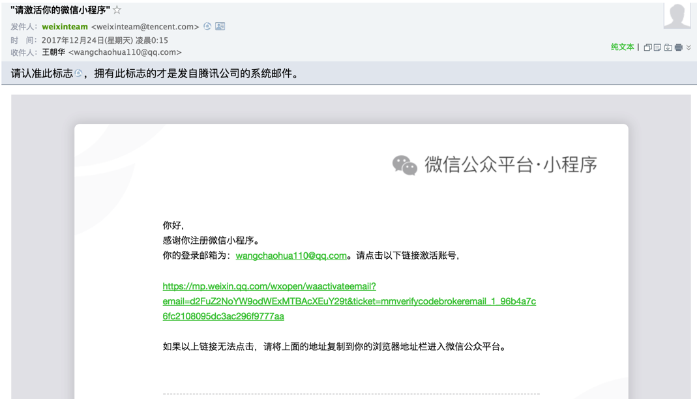
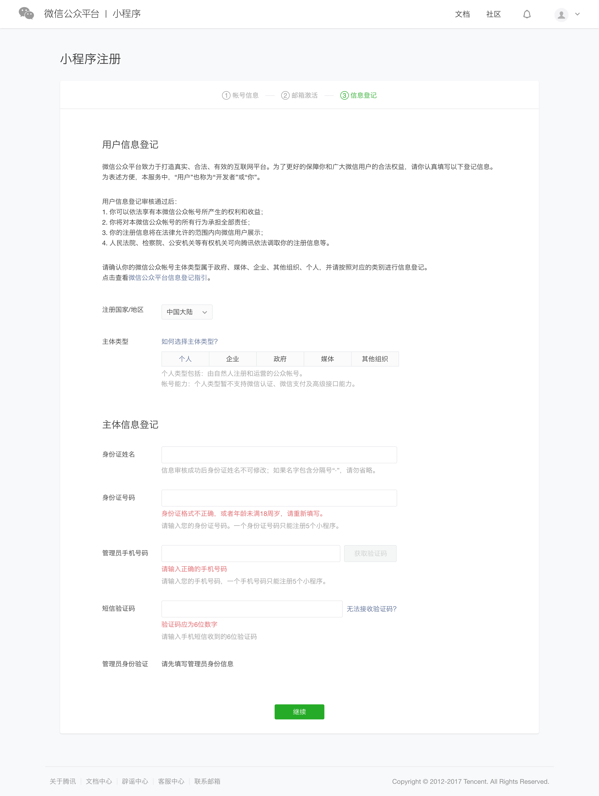
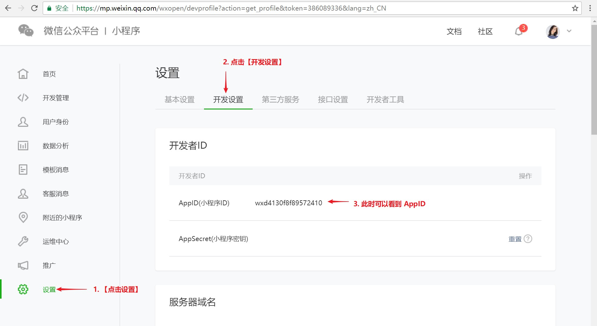

## 1. 注册账号

> 开始小程序的第一步就是要注册一个属于自己的小程序账号, 这个账号主要是用来对自己开发的小程序做些管理。

1. 注册账号
    [账号申请地址](https://mp.weixin.qq.com/wxopen/waregister?action=step1)

    输入信息的后，点击【注册】按钮进行注册。

    

2. 激活账号
    注册之后，会收到一封邮件，需要点击邮件中的连接再继续填写相关信息! (目的是为了确认是不是自己的邮箱)

    

3. 完善账号信息

    下面中有 【个人】，【企业】等选项，不是为公司开发产品的话，直接选择【个人】，然后填写相关信息。
    

信息填写完成之后，页面下方会出现一个二维码，用自己的微信扫描二维码， 然后点击确认

然后，点击【继续】按钮，按提示进行下步操作即可! 

## 2. 登陆账号

[登陆地址](https://mp.weixin.qq.com/)

## 3. 查看AppID

APPID 是账号是账号的唯一标识, 在小程序开发时需要。

登陆后可以查看 AppID

