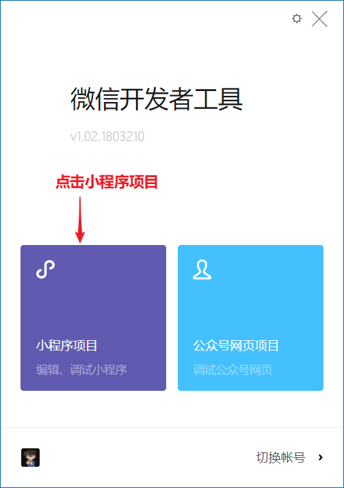
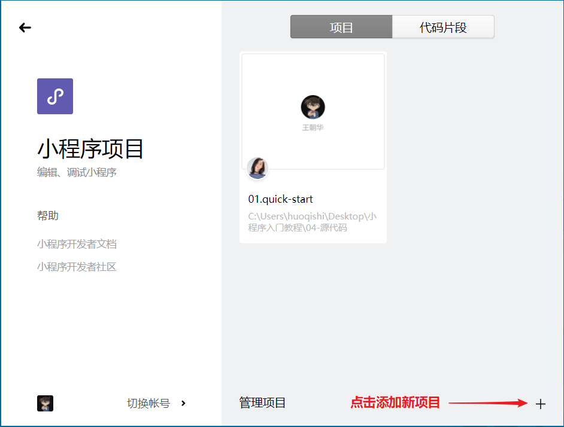
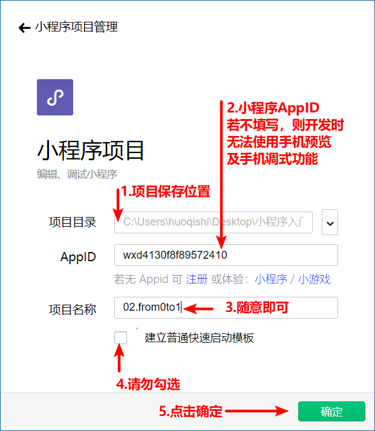
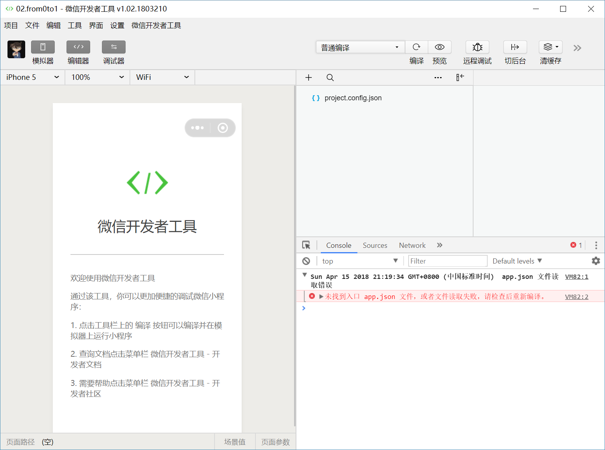

## 1. 打开开发工具

> 微信扫码登陆


## 2. 选择项目类型



## 3. 添加新项目



## 4. 填写项目信息

> 如果选择的【项目目录】中，已有一个项目，则会打开该项目，不会创建新项目。



## 5. 开发界面



## 6. 添加页面

在根目录:

1. 新建 `pages` 文件夹
2. 新建 `home` 页面，要包含 `home.wxml`, `home.js`, `home.wxss`, `home.json` 4 个文件
   + pages/home/home.wxml
   + pages/home/home.js
   + pages/home/home.wxss
   + pages/home/home.json

3. 新建 detail 页面，要包含 `detail.wxml`, `detail.js`, `detail.wxss`, `detail.json` 4 个文件
   + pages/detail/detail.wxml

   + pages/detail/detail.js

   + pages/detail/detail.wxss

   + pages/detail/detail.json

**注意: 不需要在页面中引入样式或者js文件, 样式及js会自动生效**

home.wxml

```xml
<view>
  <text>首页</text>
  <navigator url="/pages/detail/detail">跳转到详情页</navigator>
</view>
```

home.js

```js
// 页面初始化
Page({})
```

home.json

```json
{}
```

detail.wxml

```xml
<view>
  <text>详情页</text>
</view>
```

detail.js

```js
// 页面初始化
Page({})
```

detail.json

```json
{}
```
## 7. 添加全局配置

在根目录:

1. 新建`app.json`文件

app.json

**注意: json 文件中不能有注释**

```json
{
  // "pages" 数组中填写小程序中的所有页面
  // 第一条将作为首页
  "pages": [
    "pages/home/home",
    "pages/detail/detail"
  ]
}
```

## 8. 添加全局样式

在根目录:

	1. 新建`app.wxss`文件

app.wxss

```css
/*全局样式，此处的样式对所有页面生效*/
/*此处的样式优先级低于页面中的样式*/
```

## 9. 小程序初始化文件

在根目录:

1. 新建`app.js`文件

app.js

```js
/*小程序启动时执行*/
/*App 方法作用: 初始化小程序*/
App({})
```
## 示例代码

   [完整代码:flags: demo/02.from0to1](02.from0to1)


