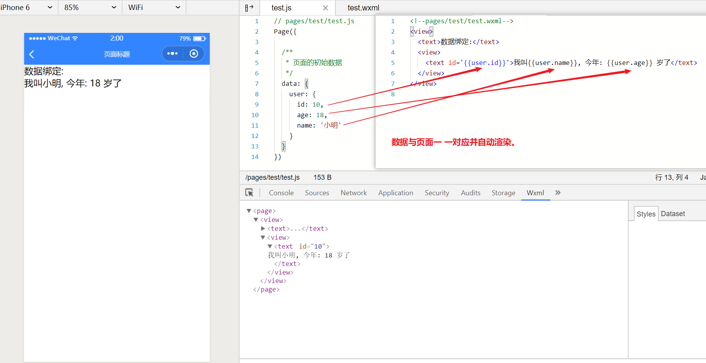
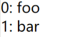
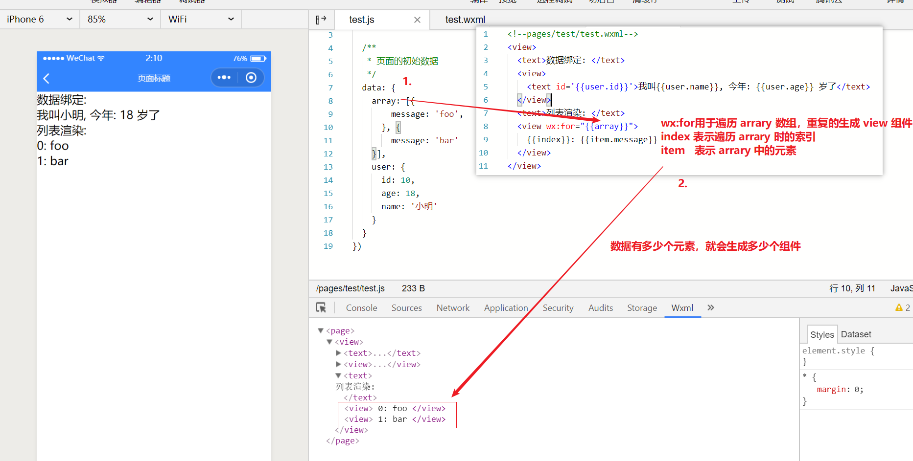

> 小程序使用数据绑定的方式代替传统网页中 dom 操作的方式来呈现数据

添加一个 test 页面，用于演示

## 1. 数据绑定

使用 Mustache 语法（双大括号）将变量包起来

test.js

```js
Page({
  // 页面中要使用的数据，需要添加到 data 对象中
  data: {
    user: {
      id: 10,
      age: 18,
      name: '小明'
    }
  }
})
```

test.wxml

```xml
<view>
  // {{}} 中直接书写 js 中 data 对象中的数据,即可展示
  <text id='{{user.id}}'>我叫{{user.name}}, 今年: {{user.age}} 岁了</text>
</view>
```

预览效果:


分析:




## 2. 列表渲染

> 在组件上使用 `wx:for` 控制属性绑定一个数组，即可使用数组中各项的数据重复渲染该组件

test.js

```js
Page({
  data: {
    array: [{
      message: 'foo',
    }, {
      message: 'bar'
    }]
  }
})
```


test.wxml

```xml
<view wx:for="{{array}}">
  {{index}}: {{item.message}}
</view>
```

 预览效果:



分析:




## 3. 条件渲染

在小程序中，使用 `wx:if="{{condition}}"` 来判断是否需要渲染该组件

```
<view wx:if="{{condition}}"> True </view>
```

也可以用 `wx:elif` 和 `wx:else` 来添加一个 else 块：

```
<view wx:if="{{length > 5}}"> 1 </view>
<view wx:elif="{{length > 2}}"> 2 </view>
<view wx:else> 3 </view>
```


