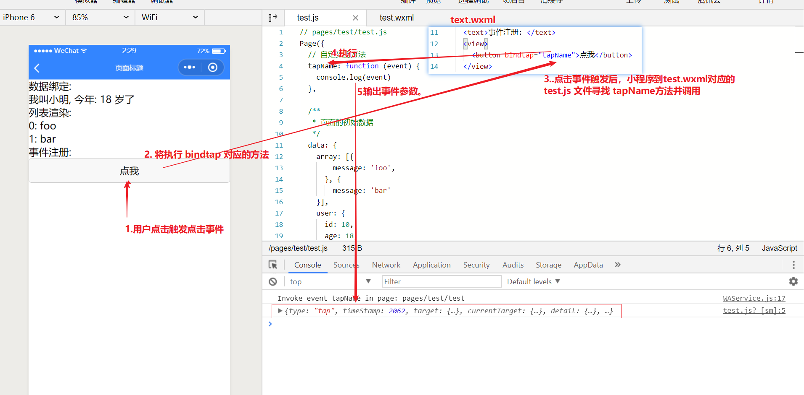

# 事件注册

> 小程序有自己特定的为组件注册事件的方式，不再是像传统网页使用 addEventListener 进行注册

### 注册事件的方式

> 使用 `bind` + `事件名` 的方式，为元素添注册事件

以点击事件为例:  事件名为 `tap`

test.js

```js
Page({
  // 自定义方法
  tapName: function(event) {
    console.log(event)
  }
})
```

test.wxml

```xml
<view bindtap="tapName">bu</view>
```

预览效果及分析:




## 其他事件

注册方式，类比 `tap` 事件

| 类型(事件名)       | 触发条件                                                     | 最低版本                                                     |
| ------------------ | ------------------------------------------------------------ | ------------------------------------------------------------ |
| touchstart         | 手指触摸动作开始                                             |                                                              |
| touchmove          | 手指触摸后移动                                               |                                                              |
| touchcancel        | 手指触摸动作被打断，如来电提醒，弹窗                         |                                                              |
| touchend           | 手指触摸动作结束                                             |                                                              |
| tap                | 手指触摸后马上离开                                           |                                                              |
| longpress          | 手指触摸后，超过350ms再离开，如果指定了事件回调函数并触发了这个事件，tap事件将不被触发 | [1.5.0](https://developers.weixin.qq.com/miniprogram/dev/framework/compatibility.html) |
| longtap            | 手指触摸后，超过350ms再离开（推荐使用longpress事件代替）     |                                                              |
| transitionend      | 会在 WXSS transition 或 wx.createAnimation 动画结束后触发    |                                                              |
| animationstart     | 会在一个 WXSS animation 动画开始时触发                       |                                                              |
| animationiteration | 会在一个 WXSS animation 一次迭代结束时触发                   |                                                              |
| animationend       | 会在一个 WXSS animation 动画完成时触发                       |                                                              |
| touchforcechange   | 在支持 3D Touch 的 iPhone 设备，重按时会触发                 | [1.9.90](https://developers.weixin.qq.com/miniprogram/dev/framework/compatibility.html) |